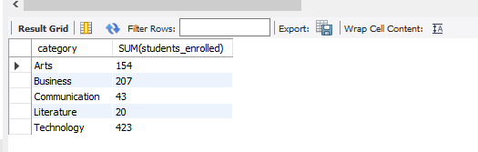

# Finals Lab Task 3.1: Using SELECT CLAUSE
For this task, we are given initial query then perform the SELECT statements required for each problems. 

## Here’s the Query Statements

Fisrt, a command that create a database, so subsequent SQL operations will be performed within that specific database.
```sql
CREATE DATABASE online_courseDB;
USE online_courseDB;
```


## Here's the screenshot of the whole Query Statements and Table Structure (See screenshots)

### TASK 1


### TASK 2



### TASK 3


### TASK 4


### TASK 5


