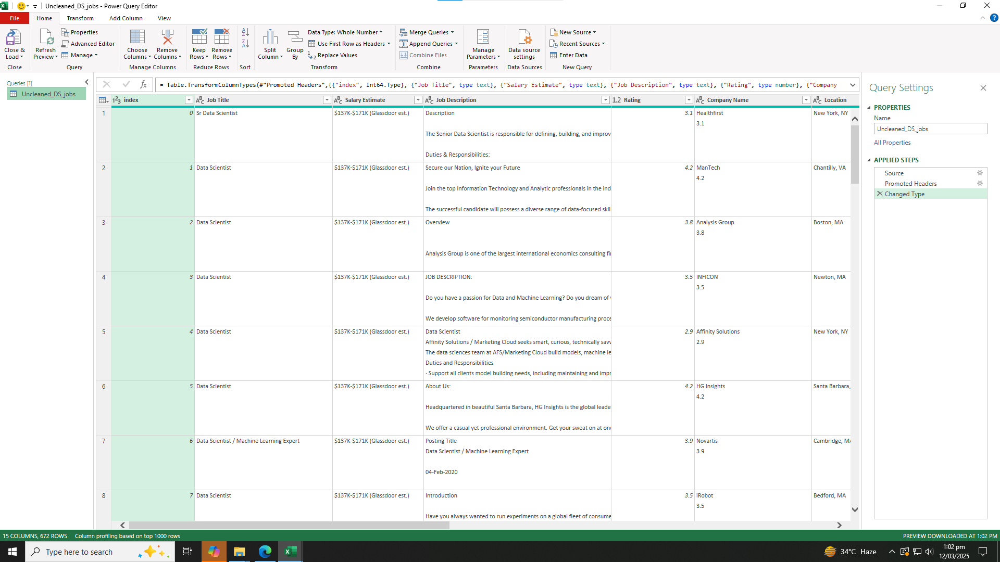

## Midterm Lab Task 2 – Data Cleaning and Transformation Using Power Query Editor
## 1. Task Description:
Company X would like to extract valuable insights from the "UncleanedDSJObs.csv" dataset taken from a job posting site available on Kaggle. The dataset has several columns, but the main task is to clean and transform the data to answer the following business questions:

1. Which Job Roles pay the highest and least?
2. What size companies pay the best?
3. Where do Job Roles or Job Titles pay the best and least in a specific state?
The data requires cleaning, transformation, and organization in Power Query Editor to generate answers to these questions.

## 2. Screenshot of the Dataset Before Data Cleaning and Transformation:

## 3. Steps Performed in Data Cleaning and Transformation:

## Step 1: Loading the Data into Power Query
- Open Excel and go to Data > Get Data > From Text/CSV.
- Load the raw CSV file UnclenedDSJObs.csv into Power Query.
## Step 2: Duplicate the Raw Data
- In Power Query, right-click on the dataset and select Duplicate.
-   This ensures that we keep an original version of the raw data for reference.
## Step 3: Data Cleaning and Transformation Tasks
-   Salary estimate Column:

Select the Salary Estimate column.
Go to the Transform menu -> Extract.
Choose Text Before Delimiter, enter ( as the delimiter.
Apply this to clean the salary data to just the numeric values before the parentheses.
- Create Min and Max Salary Columns:

Add two new columns (Min Sal and Max Sal).
Use Column from Examples to create these new columns.
Enter a value like 101 for the minimum salary and the appropriate value for the maximum salary in their respective cells.
Rename the columns as Min Sal and Max Sal.
- Role Type Classification:

Add a Role Type column.
Use a Custom Column and enter the following formula:
vbnet
Copy
if Text.Contains([Job Title], "Data Scientist") then "Data Scientist"
else if Text.Contains([Job Title], "Data Analyst") then "Data Analyst"
else if Text.Contains([Job Title], "Data Engineer") then "Data Engineer"
else if Text.Contains([Job Title], "Machine Learning") then "Machine Learning Engineer"
else "other"
Change the data type of the new column to Text.
- Location Cleaning:

Select the Location column.
Use a Custom Column to clean and fix the location abbreviations (e.g., "California" becomes ", CA").
After applying the custom logic, split the Location column by delimiter ,.
Create a State Abbreviations column and filter for any outliers or incorrect entries.
- Handling Negative Values:

For columns like Competitors, Revenues, and Industry, filter out any rows with negative or zero values (e.g., filter -1 values in Competitors).
- Cleaning Company Names:

Remove any "Rates" after company names in the Company Name column.
Apply this using Transform > Replace Values.
## Step 4: Reshaping and Grouping Data
- Group Data by Role Type:

Right-click and duplicate the raw data.
Select the Role Type, Min Sal, and Max Sal columns.
Change the data types of Min Sal and Max Sal to currency.
Multiply the salaries by 1000.
Group the data by Role Type and calculate the average Min Sal and Max Sal for each role.
- Group Data by Company Size:

Create a reference of the raw data and rename it Sal By Role Size ref.
Choose the Size, Min Sal, and Max Sal columns.
Perform the same transformation as in the previous step to group by company size and calculate average salaries.
- Group Data by State:

Create another reference of the raw data and rename it Sal By State ref.
Choose State Full Name, Min Sal, and Max Sal columns.
Perform the same transformation as in previous steps for state grouping.
## Step 5: Merging State Data:
